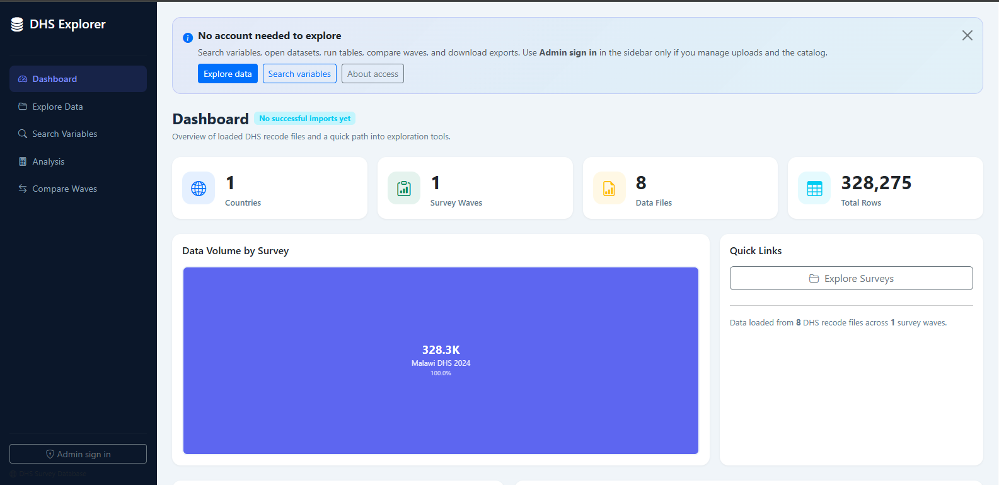

# DHS Data Explorer

A focused toolkit for loading, cleaning, exploring, and exporting Demographic and Health Survey (DHS) microdata. The project combines a robust ETL loader with a Flask web UI and a small REST API to make DHS microdata usable for analysis.

**What's in this README**
- Problem: common DHS data cleaning challenges
- Solution: what this project provides
- Quick start: run locally or in Docker
- Demo & screenshots: how to link or add images

## Problem — why DHS data cleaning is hard

- DHS microdata comes as many recode files (Stata `.dta`) packaged in ZIPs with inconsistent naming and variable conventions across countries and years.
- Variables are frequently renamed, recoded, or moved between recodes (e.g. HR/IR/PR), so matching the same concept across waves is non-trivial.
- Value labels are stored separately from numeric values and must be applied to produce human-readable outputs.
- Large surveys produce wide tables that can exceed free cloud-tier storage limits; loading must be resumable and idempotent.
- Analysts need consistent variable dictionaries, searchable metadata, and repeatable exports to avoid manual, error-prone cleaning.

## Solution — what this project offers

- Automated discovery and extraction of DHS ZIP recode files with metadata parsing (variable dictionaries and value labels).
- A catalog layer to register surveys, files, and import batches so ingestion is auditable and resumable.
- Bulk-loading logic that creates dynamic wide tables for core recodes and stores auxiliary recodes as JSONB when appropriate.
- Value-label decoding during export and analysis so frequency tables and cross-tabs show readable labels.
- A searchable variable dictionary, wave-comparison tools, and lightweight analysis endpoints to reduce manual cleaning work.

## Key features

- Loader: CLI to discover and ingest DHS ZIP files
- Web UI: dashboard, variable search, wave comparison, upload/delete
- API: export CSV/Excel/JSON with optional label application
- Auth: admin/viewer roles, magic links, password login
- Deployable to Docker, Render + Neon (Postgres)

## Quick start (local)

### Prerequisites

- Python 3.11+
- PostgreSQL 14+

### Install

```bash
pip install -r requirements.txt
```

### Configure

Set environment variables (or use a `.env`): `DATABASE_URL` or the `DHS_DB_*` vars, `DHS_SECRET`, `DHS_ADMIN_EMAIL`, `DHS_PASSWORD`. See `run_web.py` and `loader/config.py` for details.

### Initialize DB and load data

Create the database and run the loader to discover and import files placed in `data/`:

```bash
createdb dhs
python -m loader all
```

To load a specific survey or resume a failed run:

```bash
python -m loader load --only-year 2024 --only-program DHS
```

### Run the web app

```bash
python run_web.py
```

Open http://localhost:5000 and sign in with the admin email/password set earlier.

## Docker

Start locally with Docker Compose:

```bash
docker compose up --build
```

Place ZIPs in `./data/` and use the Upload page or CLI.

## Demo and screenshots


- Live demo: https://dhs-explorer.onrender.com/

- Screenshots: add images to `webapp/static/screenshots/` (create the folder if needed) and reference them here. Example markdown to embed an image:

```markdown

```

If you don't yet have screenshots, the `webapp/static/screenshots/` folder is a good place to add them; the README will show them once committed.

### Screenshots



Below is a screenshot of the app dashboard. More images can be added to `webapp/static/screenshots/` and will appear here once committed.


## Project structure (high level)

- `loader/` — ETL pipeline and CLI
- `webapp/` — Flask app, blueprints, templates, static
- `migrations/` — SQL migration scripts
- `tests/` — unit and integration tests

## Deploy (Render + Neon)

This project includes a `render.yaml` blueprint. Typical steps:

1. Create a Neon Postgres database and copy the connection string.
2. Push this repo to GitHub and connect Render to the repo.
3. Set `DATABASE_URL`, `DHS_SECRET`, `DHS_ADMIN_EMAIL`, `DHS_PASSWORD`, and optional SMTP vars in the Render service settings.

## Contributing

Contributions welcome. Please open issues for bugs or feature requests and submit pull requests against `main`.

## License

See the `LICENSE` file at the repository root.
